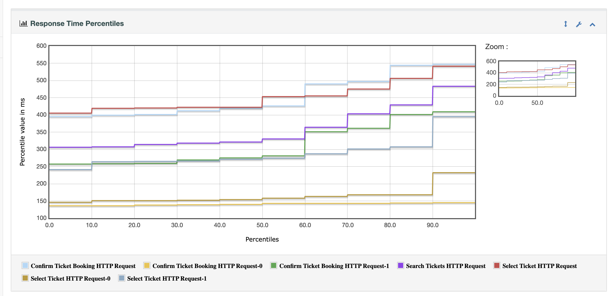

# Load Test for BlazeDemo 🚀

This repository contains performance testing scripts for the BlazeDemo website using both **Apache JMeter** and **k6**. The tests simulate load and performance metrics by sending HTTP requests to the application and checking response times ⏱️ and correctness ✅.

## Test Plan Overview 📝

The test plan consists of the following main parts:

1. **JMeter Tests**: Simulates 10/100/1000 users performing various operations such as searching for tickets ✈️, selecting a flight, and confirming a booking.
2. **k6 Tests**: Another method to simulate load, perform the same operations, and generate performance reports.
3. **Assertions**: Response code and content assertions to verify the correctness of the server's response.
4. **Results Collection**: Collects detailed test results, including response times, latency, and success status for both JMeter and k6.

## Requirements 🛠️

- [Apache JMeter](https://jmeter.apache.org/) 5.6.3 or later
- [k6](https://k6.io/docs/) 0.44.0 or later
- Java 8 or later ☕️

## How to Run 🏃‍♂️

### Running JMeter Test

1. Download and install [Apache JMeter](https://jmeter.apache.org/).
2. Clone this repository to your local machine 💻.
3. Open JMeter `bin` folder in the terminal.
4. To run the JMeter test from the command line, use the following command:

   ```bash
   ./jmeter -n -t ${PATH_TO_TEST_PLAN}/LoadTestBlazeDemo.jmx -JUSERS_COUNT=${THREADS_NUMBER} -l <path_to_results_folder>/Results-${THREADS_NUMBER}-users.jtl -e -o ${PATH_TO_RESULTS_FOLDER}/Test-Report-${THREADS_NUMBER}

### Running k6 Test

1. Install [k6](https://k6.io/docs/getting-started/installation/) if you haven't already.
2. Clone this repository to your local machine 💻.
3. Navigate to the `k6` folder containing the test scripts.
4. Run the k6 test with the following command:

   ```bash
   k6 run loadtest.js --vus ${THREADS_NUMBER} --duration 30s

## GMeter Test Plan Structure 📂

The test plan includes the following:

- **Thread Group**: Configures the number of threads (users) and ramp-up time ⏳.
- **HTTP Request Samplers**: Sends HTTP requests to the BlazeDemo website (searching, selecting flights, and booking tickets) ✈️.
- **Assertions**: Ensures that the response codes and content are correct.
- **Result Collectors**: Saves test results for further analysis.

## Example Report 📊

A sample report can be found in the `test-results` folder. Additionally, here's a screenshot showing the response time from the report:



## Link to BlazeDemo 🌐

Visit the BlazeDemo website for more details: [https://blazedemo.com/](https://blazedemo.com/)

## License 📜

```
MIT License

Copyright (c) 2025 Yevhenii Marchenko

Permission is hereby granted, free of charge, to any person obtaining a copy
of this software and associated documentation files (the "Software"), to deal
in the Software without restriction, including without limitation the rights
to use, copy, modify, merge, publish, distribute, sublicense, and/or sell
copies of the Software, and to permit persons to whom the Software is
furnished to do so, subject to the following conditions:

The above copyright notice and this permission notice shall be included in all
copies or substantial portions of the Software.

THE SOFTWARE IS PROVIDED "AS IS", WITHOUT WARRANTY OF ANY KIND, EXPRESS OR
IMPLIED, INCLUDING BUT NOT LIMITED TO THE WARRANTIES OF MERCHANTABILITY,
FITNESS FOR A PARTICULAR PURPOSE AND NONINFRINGEMENT. IN NO EVENT SHALL THE
AUTHORS OR COPYRIGHT HOLDERS BE LIABLE FOR ANY CLAIM, DAMAGES OR OTHER
LIABILITY, WHETHER IN AN ACTION OF CONTRACT, TORT OR OTHERWISE, ARISING FROM,
OUT OF OR IN CONNECTION WITH THE SOFTWARE OR THE USE OR OTHER DEALINGS IN THE
SOFTWARE.
```